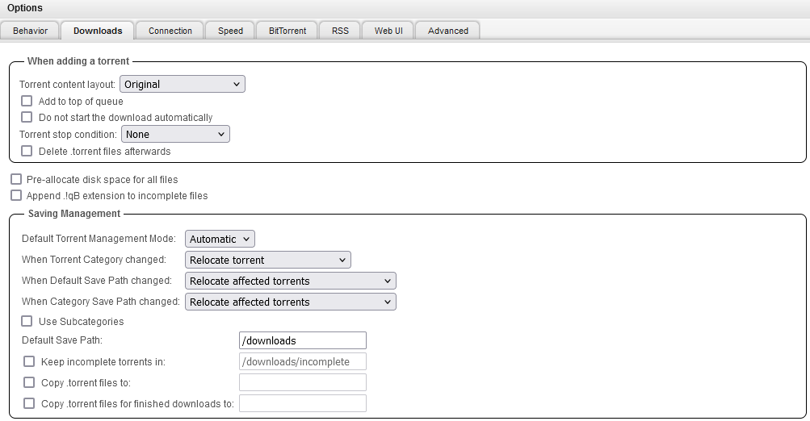
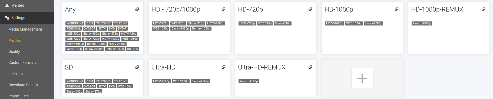
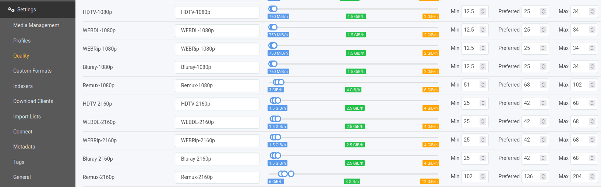
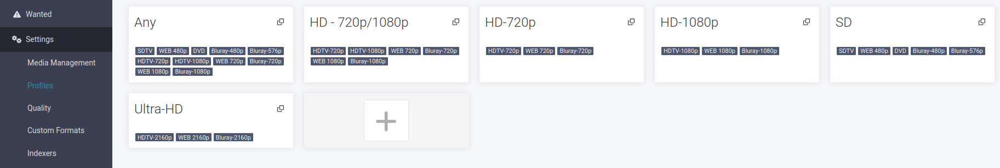
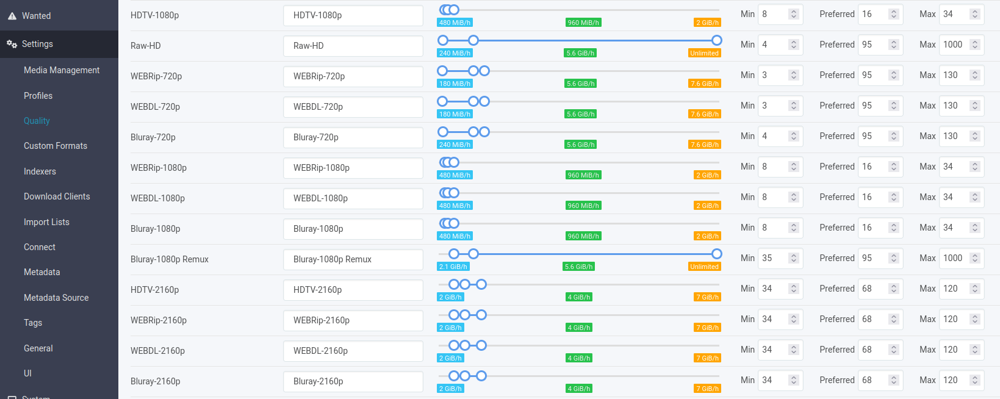

# media-server

- https://github.com/AdrienPoupa/docker-compose-nas
- https://github.com/Morzomb/All-jellyfin-media-server

Deploy the applications using the following command:

```
docker compose up -d
```

Once deployed, you can access them using the following addresses:

- Jellyfin : http://localhost:8096
- Jellyseer : http://localhost:5055
- Sonarr : http://localhost:8989
- Radarr : http://localhost:7878
- Bazarr : http://localhost:6767
- Prowlarr : http://localhost:9696
- qBittorrent : http://localhost:8080

**TODO** release profiles

# Prerequisites

### Docker

https://docs.docker.com/engine/install/ubuntu/

Add your user to the Docker group

```
sudo usermod -aG docker $USER
```

Configure the default logging driver to rotate the logs. Add or modify the **daemon configuration file** at `/etc/docker/daemon.json`

```
{
    "log-driver": "json-file",
    "log-opts": {
        "max-size": "10m",
        "max-file": "3"
    }
}
```

### Environment

Create a `.env` file in this folder and fill in the enviroment variables needed for the `docker-compose.yml` file. See `.env-template` to get started.

### Folder structure

The following folder structure is needed in the root folder of your choosing.

```
├── config
│   ├── bazarr
│   ├── gluetun
│   ├── jellyfin
│   ├── jellyseerr
│   ├── prowlarr
│   ├── qbittorrent
│   ├── radarr
│   └── sonarr
├── downloads
│   ├── radarr
│   └── sonarr
└── media
    ├── movies
    └── tvshows
```

# VPN
To ensure anonymity and access to geo-restricted content, it’s recommended to route your qBittorrent traffic through a VPN. This stack uses **Gluetun** to enable VPN support.

# Configuration

## Jellyfin

Go to the Jellyfin webui and configure Jellyfin.
Enable `Automatically merge series that are spread across multiple folder` when adding a **Shows** Library.

### hardware acceleration

1. Download `jellyfin-ffmpeg`
2. Install the `nvidia-container-toolkit`
3. Add your username to the video group

```
sudo usermod -aG video $USER
```

4. Check the NVIDIA GPU's status by using `nvidia-smi`

```
docker exec -it jellyfin nvidia-smi
```

5. Go to `Dashboard -> Playback -> Transcoding`

- Enable hardware acceleration
- Enable hardware encodings for the ones your GPU supports
- Set the transcoding folder to: /transcode

## qBittorrent

qBittorrent Web UI will generate a temporary password when the container is started. To view this password, check the logs for this container with the command:

```
docker logs qbittorrent
```

To use the VueTorrent WebUI just go to qBittorrent, Options, Web UI, Use Alternative WebUI, and enter `/vuetorrent`.

### options

1. Once logged in, click the gear icon to go to **Options**.
2. Under the **WebUi** tab, update the password.
3. Under the **Downloads** tab, configure the backup settings as follows:
   - **Default Torrent Management Mode**: `Automatic` (required for category-based save paths to work)
   - **When Torrent Category changed**: `Relocate torrent`
   - **When Default Save Path changed**: `Relocate affected torrents`
   - **When Category Save Path changed**: `Relocate affected torrents`
   - **Default Save Path**: `/downloads`
4. Under the **BitTorrent** tab, set the **Seeding Limits** to acceptable values and chose: then `Remove torrent`
5. Click **SAVE**.

<div style="text-align: center">
    
</div>

### category configuration

1. In the WebUI, expand **CATEGORIES** in the left menu. Right-click on **All** and select **Add category...**.
2. In the **New Category** window, configure as follows:
   - **Category**: `radarr` (this corresponds to the category you will later configure in Radarr)
   - **Save path**: `/downloads/radarr`
3. Click **Add**.
4. Right-click on **All** again, select **Add category...**.
5. Configure as follows:
   - **Category**: `sonarr` (this should match the category configured later in Sonarr, by default `sonarr-tv`, but this guide uses `sonarr`)
   - **Save path**: `/downloads/sonarr`
6. Click **Add**.

## Radarr

### media management

1. Open the WebUI and go to **Settings** > **Media Management**.
2. Click **Add Root Folder**, add the path `/movies`, and click **OK**.
3. Click **Show Advanced** at the top, scroll down to **Importing**, and make sure **Use Hardlinks instead of Copy** is enabled.

### download clients

1. In the WebUI, go to **Settings** > **Download Clients**.
2. Click **+** under **Download Clients**, then select **qBittorrent** from the **Add Download Client** window.
3. Fill in the fields as follows:
   - **Name**: `qBittorrent` (or another name of your choice)
   - **Host**: `localhost`
   - **Username**: `admin`
   - **Password**: (password chosen in qBittorrent)
   - **Category**: `radarr` (this should match the category set in qBittorrent)
4. Click **Test**. If you see a checkmark, it means the connection is working; if not, there is an error.
5. Click **Save**.

### profiles & quality

1. Configure the profile settings in **Settings** > **Profiles**. Update/create `HD-1080p`, `HD-1080p-REMUX`, `Ultra-HD` and `Ultra-HD-REMUX` (REMUX are the raw files, so best quality but takes a lot of space). Select the **Qualities** as shown in the picture below and set the **Language** to `Original`

<div style="text-align: center">
    
</div>

2. Configure the quality settings in **Settings** > **Quality**.

<div style="text-align: center">
    
</div>

_Note: if entering `localhost` as the Host does not work, try entering the IP address instead (ex: `192.168.x.x`)_

## Sonarr

### media management

1. Open the WebUI and go to **Settings** > **Media Management**.
2. Click **Add Root Folder**, add the path `/COMMON_PATH/sonarr/tv`, and click **OK**.
3. Click **Show Advanced**, scroll down to **Importing**, and enable **Use Hardlinks instead of Copy**.

_Note: if entering `qbittorrent` as the Host does not work, try entering the IP address instead (ex: `192.168.x.x`)_

### download clients

1. In the WebUI, go to **Settings** > **Download Clients**.
2. Click **+** under **Download Clients**, then select **qBittorrent**.
3. Fill in the fields as follows:
   - **Name**: `qBittorrent` (or another name of your choice)
   - **Host**: `qbittorrent`
   - **Username**: `admin`
   - **Password**: (password chosen in qBittorrent)
   - **Category**: `sonarr` (this should match the category set in qBittorrent)
4. Click **Test**. If you see a checkmark, it means the connection is working.
5. Click **Save**.

### profiles & quality

1. Configure the profile settings in **Settings** > **Profiles**. Update `HD-1080p` and`Ultra-HD` (no REMUX here, is rare and takes up too much space for tv shows). Select the **Qualities** as shown in the picture below.

<div style="text-align: center">
    
</div>

2. Configure the quality settings in **Settings** > **Quality**.

<div style="text-align: center">
    
</div>

## Bazarr

### Languages

1. Open the WebUI and go to **Settings** > **Languages**.
2. Configure **Language Filter** (eg. Dutch & English).
3. Add **Languages Profile** (eg. Dutch & English).
4. Set default language profiles (eg. Dutch).

### providers

1. Go to **Settings** and click **Providers**.
2. Add the following providers:
   - OpenSubtitles.com (account needed)
   - Embedded Subtitles
   - Supersubtitles
   - TVSubtitles
   - YIFY Subtitles

### configure Radarr

1. Go to **Settings** and click **Radarr** and fill in the information as follows:
   - **Adress**: ip-adress
   - **Port**: 8989
   - **ApiKey**: Find the API key in the Radarr interface under **Settings** > **General** > **API Key**.
2. Click **Test** to check the connection.
3. Click **Save**.

### configure Sonarr

1. Go to **Settings** and click **Sonarr** and fill in the information as follows:
   - **Adress**: ip-adress
   - **Port**: 8989
   - **ApiKey**: Find the API key in the Sonarr interface under **Settings** > **General** > **API Key**.
2. Click **Test** to check the connection.
3. Click **Save**.

## Prowlarr

### configure torrent indexers

1. Open the WebUI and go to **Indexers** > **Add New Indexer**.
2. Select **1337x** (or another tracker of your choice).
   - You can modify the settings as per your preference, but the default values generally work well.
   - Sorting by **Seeders** can be useful for faster downloads.
3. Click **Test**. If you see a checkmark, the connection is functional; otherwise, there's an error.
4. Click **Save**.

### configure FlareSolverr

1. Go to **Settings** and click **+** under **Indexer**.
2. Select **FlareSolverr** and fill in the information as follows:
   - **Name**: `FlareSolverr`
   - **Tags**: `flaresolverr`
   - **Host**: `http://flaresolverr:8191/`
3. Click **Test** to check the connection.
4. Click **Save**.

### configure Radarr

1. Go to **Settings** and click **Apps**.
2. Select **Radarr** and fill in the information as follows:
   - **Sync Level**: `Full Sync`
   - **Prowlarr Server**: `http://prowlarr:9696`
   - **Radarr Server**: `http://radarr:7878`
   - **ApiKey**: Find the API key in the Radarr interface under **Settings** > **General** > **API Key**.
3. Click **Test** to check the connection.
4. Click **Save**.

### configure Sonarr

1. Go to **Settings** and click **Apps**.
2. Select **Sonarr** and fill in the information as follows:
   - **Sync Level**: `Full Sync`
   - **Prowlarr Server**: `http://prowlarr:9696`
   - **Sonarr Server**: `http://sonarr:8989`
   - **ApiKey**: Find the API key in the Sonarr interface under **Settings** > **General** > **API Key**.
3. Click **Test** to check the connection.
4. Click **Save**.

## Jellyseerr

### sign in / configuration

1. Open the WebUI and in the **Welcome to Jellyseerr** screen, select **Use your Jellyfin account**.
2. Fill in the information as follows:
   - **Jellyfin URL**: `http://jellyfin:8096/`
   - **Email Address**: `<your email address>`
   - **Username**: `<your Jellyfin username>`
   - **Password**: `<your Jellyfin password>`
3. Select **Sign In**.
4. Go to **Sync Libraries** under **Jellyfin Libraries**, select your Jellyfin libraries, then click **Continue**.

### **Integrating with Radarr**

1. Go to **Radarr Settings**, then click **Add Radarr Server**.
2. Fill in the information as follows:
   - **Default Server**: Check this box
   - **Server Name**: `Radarr`
   - **Name or IP Address**: `http://radarr`
   - **Port**: `7878`
   - **API Key**: Find the API key in the Radarr interface under **Settings** > **General** > **API Key**.
3. Click **Test** to check the connection.
4. Click **Save Changes**.

### **Integrating with Sonarr**

1. Go to **Sonarr Settings**, then click **Add Sonarr Server**.
2. Fill in the information as follows:
   - **Default Server**: Check this box
   - **Server Name**: `Sonarr`
   - **Name or IP Address**: `http://sonarr`
   - **Port**: `8989`
   - **API Key**: Find the API key in the Sonarr interface under **Settings** > **General** > **API Key**.
3. Click **Test** to check the connection.
4. Click **Save Changes**.

# Laptop Specific Configuration

If the server is installed on a laptop, you may want to disable the suspension when the lid is closed: `sudo nano /etc/systemd/logind.conf`

Replace:

- #HandleLidSwitch=suspend by HandleLidSwitch=ignore
- #HandleLidSwitchDocked=ignore by HandleLidSwitchDocked=ignore
- #LidSwitchIgnoreInhibited=yes by LidSwitchIgnoreInhibited=no

Then restart: `sudo service systemd-logind restart`

This behavior can be overwritten by the desktop environment.

E.g. for linux mint undertake the following steps:

1. Open **Power Management**
2. Go to the **Power** tab
3. Under **Power options**, set `When laptop lid is closed` to `Do nothing` for AC power

# Possible improvements

- proxmox
- truenas
- tailscale
